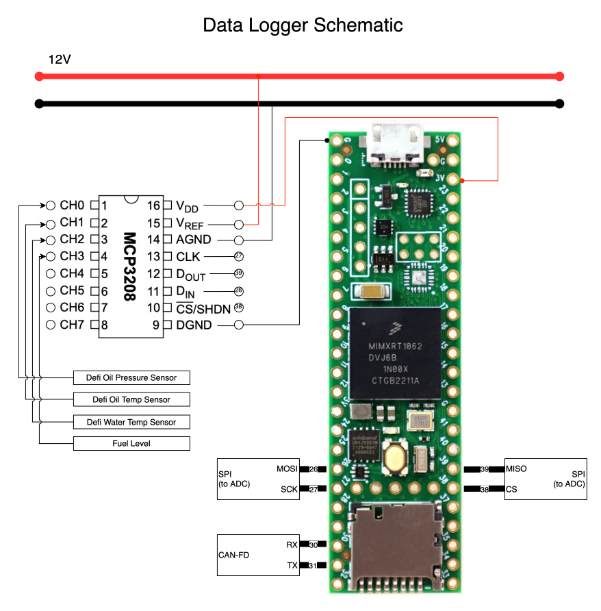

# TrackCAN : Data Logger Node

This node's main purpose is to listen on the can bus, and record vehicle data to sd card.
Its secondary purpose is to translate Defi sensor gauges and transmit classic messages

